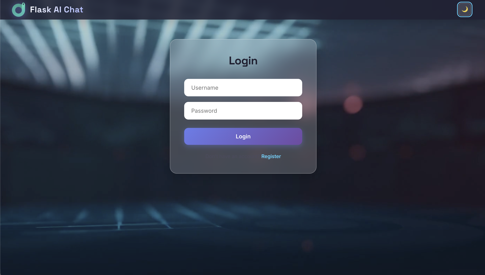
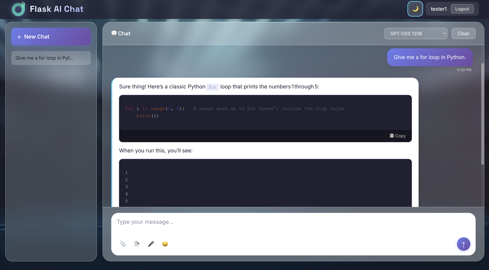
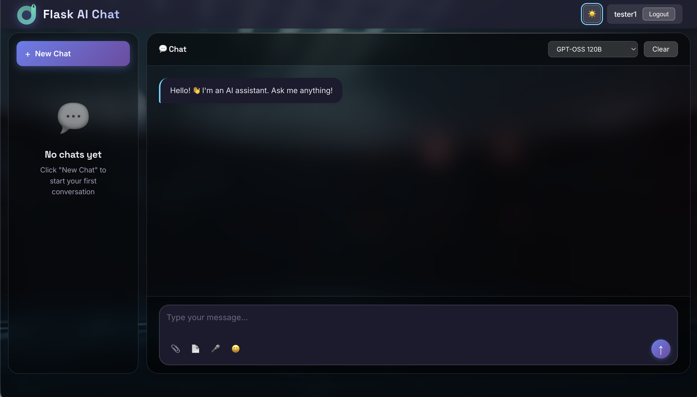
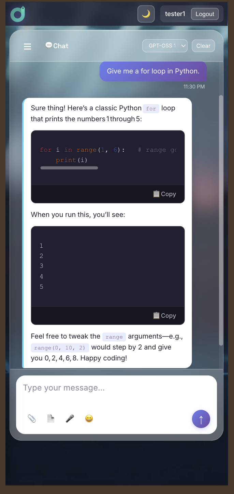

# 🤖 Flask AI Chat

A full-stack AI chat application built with Flask and Groq API.
Features streaming responses, multimodal support, voice interaction, and more.


## ✨ Features

### 💬 Chat
- **Real-time streaming** — responses appear word-by-word
- **Markdown rendering** — tables, code blocks, headings
- **Syntax highlighting** — code with colors
- **Copy buttons** — copy messages and code blocks
- **Multi-chat** — sidebar with chat history
- **Persistent storage** — SQLite database

### 🤖 AI
- **Multiple models** — GPT-OSS 120B, GPT-OSS 20B, Qwen 3.8 27B
- **Multimodal** — image analysis with vision models
- **PDF reading** — extract text and analyze documents
- **Tool calling** — get time, show maps
- **Custom personality** — friendly and casual

### 🎤 Voice
- **Text-to-Speech** — Google gTTS
- **Speech-to-Text** — Groq Whisper
- **Auto language detection** — Turkish/English

### 🎨 UX
- **Dark mode** — toggle with localStorage
- **Mobile responsive** — drawer sidebar, touch-friendly
- **Modern design** — glassmorphism, animations
- **Toast notifications** — feedback for actions
- **Confirm modals** — safe destructive actions

### 🔐 Security
- **User authentication** — register/login with password hashing
- **Rate limiting** — prevent abuse
- **Security headers** — X-Frame-Options, etc.
- **Input validation** — sanitization

## 🖼️ Screenshots

### Main Chat


### Code Highlighting


### Dark Mode


### Mobile


## 🛠️ Tech Stack

| Layer | Technology |
|-------|------------|
| **Backend** | Flask, SQLAlchemy |
| **AI** | Groq API (GPT-OSS, Qwen, Whisper) |
| **Voice** | gTTS (TTS), Groq Whisper (STT) |
| **Frontend** | Vanilla JS, HTML, CSS |
| **Database** | SQLite |
| **Markdown** | marked.js |
| **Highlighting** | highlight.js |
| **PDF** | pdfplumber |
| **Fonts** | Inter, Space Grotesk |

## 🚀 Quick Start

### Prerequisites
- Python 3.10+
- Groq API key ([get one free](https://console.groq.com/keys))

### Installation

```bash
# Clone the repository
git clone https://github.com/Ramo212121/flask-ai-chat.git
cd flask-ai-chat

# Create virtual environment
python -m venv venv
source venv/bin/activate  # macOS/Linux
# venv\Scripts\activate   # Windows

# Install dependencies
pip install -r requirements.txt

# Setup environment variables
cp .env.example .env
# Edit .env and add your GROQ_API_KEY
```

### Configuration

Edit `.env`:

```env
FLASK_SECRET_KEY=your-random-secret-key
GROQ_API_KEY=gsk_your_groq_api_key
```

### Run

```bash
python app.py
```

Open [http://127.0.0.1:5001](http://127.0.0.1:5001)

> **Note:** On macOS, port 5000 is used by AirPlay. Flask runs on port 5001.

## 📖 Usage

1. **Register** — create an account
2. **Chat** — type a message or use voice input
3. **Upload** — attach images (📎) or PDFs (📄)
4. **Switch models** — use the dropdown in the header
5. **Speak** — click 🔊 on AI responses
6. **Record** — hold 🎤 to dictate

## 📁 Project Structure

```
flask-ai-chat/
├── app.py                  # Flask application
├── requirements.txt        # Python dependencies
├── .env.example            # Environment variables template
├── .gitignore              # Git ignore rules
├── LICENSE                 # MIT License
├── README.md               # This file
├── NOTES.md                # Learning notes
│
├── static/
│   ├── css/
│   ├── js/
│   ├── img/
│   └── videos/
│
├── templates/
│   ├── base.html
│   ├── index.html
│   ├── login.html
│   ├── register.html
│   └── errors/
│
└── docs/
    └── screenshots/
```

## 📝 Learning Notes

See [NOTES.md](NOTES.md) for my daily learning journey, including Django comparisons and honest reflections.

## 🔐 Security

- Passwords hashed with `werkzeug.security`
- Session-based auth with `app.secret_key`
- Rate limiting (Flask-Limiter)
- Security headers (X-Frame-Options, etc.)
- Input sanitization

⚠️ **Note:** This is a learning project. For production use:
- Use HTTPS
- Set `Secure` and `HttpOnly` cookies
- Add CSRF protection
- Use environment-based secrets

## 📄 License

MIT License — see [LICENSE](LICENSE) for details.

## 🙏 Acknowledgments

- [Groq](https://groq.com/) — free AI API
- [Flask](https://flask.palletsprojects.com/) — web framework
- [marked.js](https://marked.js.org/) — markdown parser
- [highlight.js](https://highlightjs.org/) — syntax highlighting
- [Pexels](https://www.pexels.com/) — background video

## 📧 Contact

- GitHub: [@Ramo212121](https://github.com/Ramo212121)
- 🌐 **Live Demo:** [flask-ai-chat-rx29.onrender.com](https://flask-ai-chat-rx29.onrender.com/login)
---

⭐ If you like this project, give it a star!
